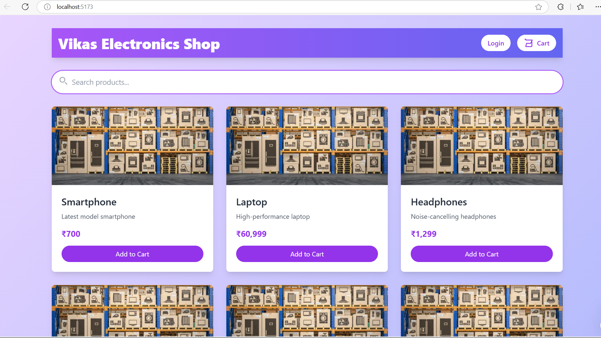
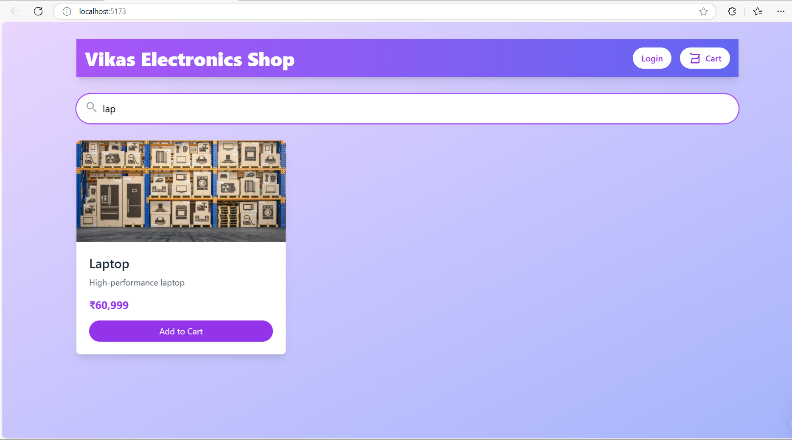
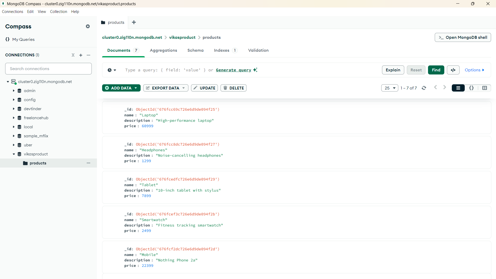

# Vikas Electronics Shop

## Features

- 🔍 **Product Search**: Users can search for products by name.
- 📡 **Backend API**: ExpressJs used to manage Route and Database to store data, From which we can fetch onto frontend.

## Screenshots

Here are some screenshots of the application:

### Frontend - Home Page

### Frontend - Product Search

### Backend - API Response

## Project Structure
The project is structured into two main folders: `frontend` and `server`.

